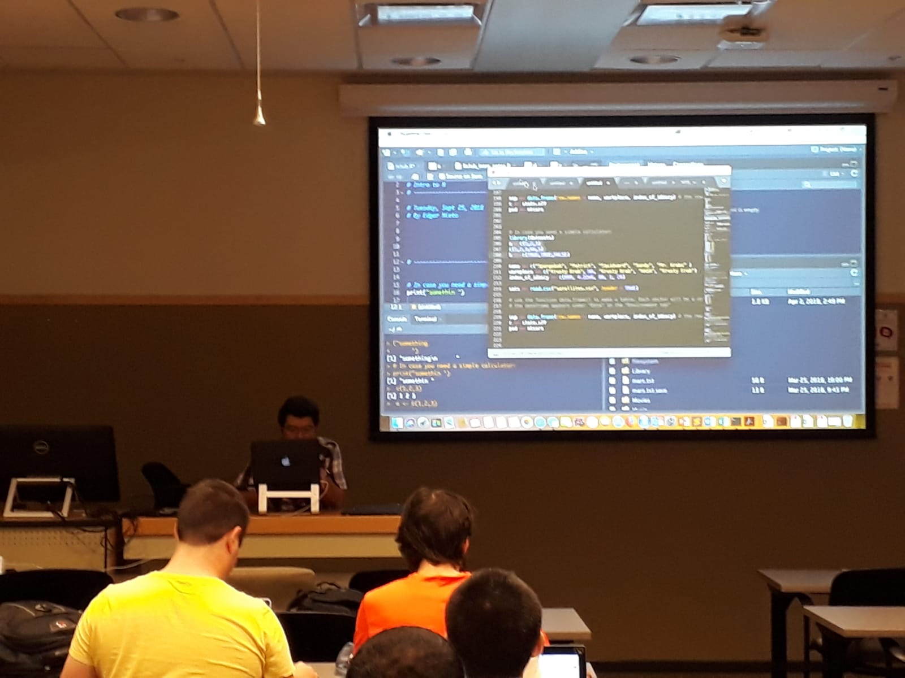

# Teaching Experience
# Experiencia en la Enseñanza

Presented a class on data wrangling of the R Club from Agronomy & Horticulture Graduate Association (AHGSA) in fall semester 2019 at UNL/Clase presentada en reordenamiento de datos complejos a unos de fácil acceso para el posterior análisis, en el club de R de la Asociación de Graduados de Agronomía  y Horticultura en el semestre de Otoño del 2019 en UNL.

Presented a class on data wrangling of the R Club from Agronomy & Horticulture Graduate Association (AHGSA) in fall semester 2018 at UNL/ Clase presentada en reordenamiento de datos complejos a unos de fácil acceso para el posterior análisis, en el club de R de la Asociación de Graduados de Agronomía  y Horticultura en el semestre de Otoño del 2018 en UNL.

Assessor Bachelors of two students of Chapingo Autonomous University Mexico, 2012-2013/Asesor de dos estudiantes de licenciatura de la Universidad Autónoma Chapingo. 

